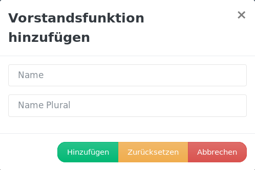
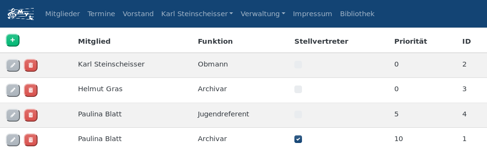
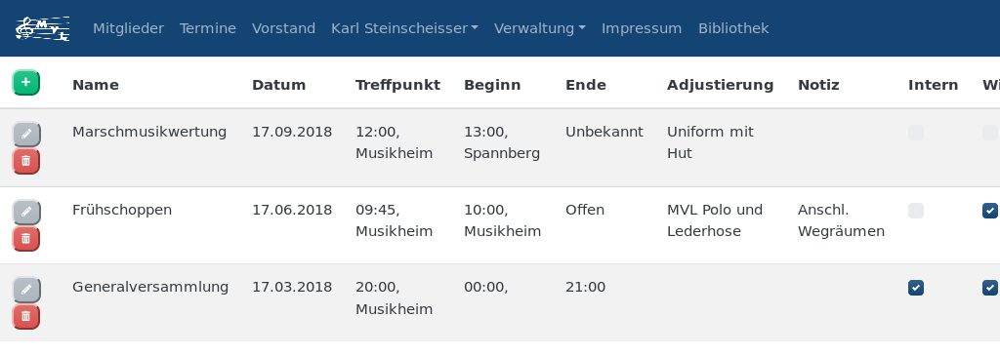

:author: Richard Stöckl
:email: richard.stoeckl@aon.at
:revdate: 2018-11-04
:revversion: 0.1
:experimental:
:toc:
:numbered:
// :toc-title: Inhaltsverzeichnis
:title: Musikverein Leopoldsdorf Webseite
:doctitle: {title}
:icons: font
:lang: de
:pdf-page-size: A5

include::lang/attributes.adoc[]

= {title}

Das hier ist die Anleitung für die Webseite des Musikverein Leopoldsdorf.
Es befinden sich sowohl Themen zum besseren Verständnis der Webseite, als auch zur Verwaltung.
Zu beachten ist jedoch, dass der Schwerpunkt auf der Verwaltung liegt, da die Ansicht sowieso selbsterklärend sein sollte.

NOTE: Diese Anleitung enthält Screenshots, welche mit einer älteren Version der Webseite angefertigt worden sind und somit möglicherweise nicht ganz dem derzeitigen Stand entsprechen.

== Menüzeile

Die Menüzeile ist für die Navigation der Webseite zuständig.
Je nachdem ob derzeit ein Benutzer einloggt ist oder nicht und welche Berechtigungen er besitzt, ändert sich geringfügig ihr aussehen.

.Standard Menüzeile
image::menubar.png[]

.Menüzeile: Josef Strauch mit erweiterten Rechten ist eingeloggt

== Mitglieder

Auf dieser Seite werden alle Mitglieder aufgelistet, die aktiv im Verein sind.
Sie sind nach den jeweiligen Instrumenten gruppiert und nach Beitritt und Name sortiert.
Angzeigt werden die Überschriften der Instrumente, der Vorname, der Nachname, der Beitritt und ein Foto.
Falls kein Foto existiert, wird ein Standardfoto abhängig vom Geschlecht angezeigt.

.Mitgliederansicht

=== Instrumentenliste

Auf der linken Seite befindet sich die Instrumentenliste.
Sie besitzen die selbe Sortierung wie die Überschriften.
Neben den Instrumenten steht eine zahl, welche anzeigt, wie viele Mitglieder diesem Instrument zugehörig sind.
Durch einen Klick auf ein Instrument, wird ein Schnellsprung zu den Mitgliedern ausgelöst.

== Termine

Hier werden alle Termine angezeigt, welche noch bevorstehen.
Angezeigt werden:

* Veranstaltungsname
* Datum
* Treffpunkt bestehend aus Uhrzeit und Ort
* Beginn bestehend aus Uhrzeit und Ort (fällt bei internen Veranstaltungen weg)
* Adjustierung
* Notiz

Wichtige Termine sind blau hinterlegt.

.Terminansicht

=== Abonnieren

Der "`Abonnieren`" Dialog taucht auf, wenn der btn:[Abonnieren] gedrückt wird.
Er ist dafür zuständig um einerseits die Termine zu abonnieren, damit sie automatisch in den eigenen Kalender synchronisiert werden, oder bei entsprechender Berechtigung kann man hier Terminpläne als PDF erstellen.
Es gibt einige Optionen, um das Abonnement bzw. den Terminplan zu spezifizieren.

[#from]
==== Von

In diesem Abschnitt wird der älteste Termin ausgwählt werden.
Das kann entweder eine Zeitspanne sein, oder ein fixer Termin.
Der fixe Termin ist hier der älteste, der miteinbezogen wird.
Wenn man eine Zeitspanne von z.B. einem Jahr auswahlt, dann bleiben die Termine genau ein Jahr gespeichert und verschwinden dann vom eigenen Kalender.
Dies verhält sich analog zu Monat, Woche und Tag.

==== Bis

Im Prinzip genau dasselbe wie bei <<from>>, nur, dass es den jüngsten Termin betrifft.
Im gegensatz zur Zeitspanne, gibt es hier lediglich eine "`unlimiert`" Option, welche bewirkt, dass neue Termine für immer nachgeladen werden und nicht bei einem Datum aufhören.

==== Notiz

Dieses Textfeld taucht nur bei entsprechender Berechtigung auf.
Es hat nur Relevanz beim Terminplan erstellen -- sie wird dann ganz unten eingeblendet.

Mit dem btn:[Abonnieren] wird der Terminplan in den eigenen Kalender abonniert und von da an automatisch immer wieder synchronisiert.
Mit dem btn:[PDF] wird ein Terminplan erstellt.

== Vorstand

Hier wird der komplette Vorstand aufgelistet.
Wenn ein Mitglied mehrere Vorstandsfunktionen hat, dann werden diese zusammengefasst.
Der Vorstand wird nach dem selben Schema wie die Instrumente sortiert, wobei auch darauf geachtet wird, dass bei einem Mitglied alle Funktionen korrekt sortiert sind.

.Vorstandsansicht

Abgebildet sind der Vorname, Nachname, Foto, die Funktionen und ob die Funktion eine Stellvertretende ist.

== Login

Hier können sich alle Mitglieder einloggen, die über einen Benutzernamen und ein Passwort verfügen und ihnen explizit erlaubt worden ist, dass sie sich einloggen dürfen.

.Login Dialog
image::login.png[]

NOTE: Die Login Schnittstelle wird nur dann angezeigt, wenn man gerade nicht eingeloggt ist.

== Vorname Nachname

In diesem Menü befinden sich alle Aktionen, die den eigenen Benutzer betreffen.

NOTE: Dieses Menü ist nur sichtbar, wenn man gerade eingeloggt ist.

=== Logout

Hier kann man sich wieder ausloggen.

[#change-password]
=== Passwort ändern

Hier kann das eigene Passwort geändert werden.
Um es ändern zu können, müssen beide Passwortfelder übereinstimmen.

Bei entsprechender Berechtigung, kann auch der Benutzername gändert werden.
Wenn man nur den Benutzernamen ändern will, darf das Feld `Passwort ändern` nicht angewählt werden.

== Verwaltung

In diesem Menü findet man alle Werkzeuge für die Datenverwaltung.
Je nachdem, welche Berechtigungen man, sind die entsprechenden Menüpunkte sichtbar.

[#lists]
=== Listen

NOTE: Das trifft auf alle Menüpunkte außer `Einstellungen` zu.

Alle Verwaltungsseiten sind Listen, welche eine Übersicht auf alle vorhandenen Daten gibt, welche sortiert sind.
Neben jedem Eintrag befinden sich ein btn:[✎] und ein btn:[🗑].
Der btn:[✎] öffnet den Dearbeitunsdialog für den jeweiligen Eintrag und der btn:[🗑] löscht den Eintrag.
Eine Ausnahme stellt die "`Mitgliederverwaltung`" dar. Bei entsprechender Berechtigung ist hier noch ein btn:[🔒] aufzufinden, welches den <<change-password>> Dialog für das jeweilige Mitglied hervorruft.
Links oben befindet sich ein btn:[+], welcher einen Dialog öffnet, mit welchem man neue Einträge hinzufügen kann.

==== Verwaltungsdialog

Ein Verwaltungsdialog erscheint, wenn man entweder einen neuen Datensatz hinzufügt, oder einen bestehenden bearbeitet.
In ihnen befinden sich die Felder, die dem Datensatz zugehörig sind.
Es gibt unterschiedliche Arten von Feldern:

Textfeld:: Ein Feld, bei dem Text eintragen werden kann, wie z.B. einen Vornamen.
Nummernfeld:: Ein Feld, bei dem ausschließlich Zahlen eingegeben werden, mit den Pfeilen, kann man den zusätzlich den Wert verändern. Beispiel: Beitrittsjahr
Box:: Sie kann entweder mit einem Haken gesetzt sein oder nicht, wie z.B. ob ein Mitglied "`aktiv`" ist.
Auswahlmenü:: Hier kann ein Wert aus einer vorhandenen Liste ausgewählt werden, wie z.B. ein Instrument.
Uhrzeit:: Hier wird eine Uhrzeit angegeben im Format `HH MM`, wie z.B. ein Terminbeginn.
Datum:: Ein Datum im Format `YYYY-MM-DD`.
`2018-03-04` wäre der 4. März 2018.
Optional kann mit einem Klick auf dem Kalender Symbol auf der rechten Seite ein Tag aus dem Kalender ausgewählt werden.

Im Dialog befinden sich unterschiedliche Knöpfe.
btn:[X] und btn:[Abbrechen] schließen den Dialog, ohne die eingetragenen Daten bzw. die Änderungen zu speichern.
btn:[Zurücksetzen] setzt die Daten zu ihrem Ursprungszustand zurück, die im Dialog waren als er geöffnet worden ist.
btn:[Ändern] bzw. btn:[Hinzufügen] speichern die Änderungen und schließen den Dialog.

=== Mitglieder

Hier werden alle Mitglieder verwaltet wie unter <<lists>> beschrieben.
Es gibt zwei Besonderheiten: Zusätzlich zum Verwaltungsdialog kann mit entsprechender Berechtigung mit dem btn:[🔒] auch der <<change-password>> Dialog für andere Mitglieder aufgerufen werden.

NOTE: Das Bild eines Mitglieds kann erst gesetzt werden, nachdem es bereits hinzugefügt worden ist.

.Mitgliederliste
image::member-list.png[]

.Mitglieder Verwaltungsdialog
image::member-modal.png[]

=== Vorstandsfunktionen

Hier werden alle Vorstandsfunktionen verwaltet, die es überhaupt gibt, wie z.B. Obmann, Kapellmeister, Stabführer,...

.Vorstandsfunktionenliste
image::leader-role-list.png[]

.Vorstandsfunktionen Verwaltungsdialog

=== Vorstand

Hier werden den Vorstandsmitgliedern die Vorstandsfunktionen zugewiesen.
Die Prioritätszahl gibt an, wie weit oben das Vorstandsmitglied aufgelistet wird -> je niedriger die Zahl, desto weiter oben steht es.
Wenn ein Vorstandsmitglied mehrere Funktionen ausübt, dann gilt immer die kleinste.

NOTE: Die Funktionen werden auch innerhalb vom Vorstandsmitglied sortiert.

.Vorstandsliste

.Vorstand Verwaltungsdialog
image::leader-modal.png[]

=== Termine

Hier werden alle Termine verwaltet.

.Terminliste

.Termine Verwaltungsdialog

=== Instrumente

Hier werden alle Instrumente verwaltet, die den Mitgliedern zugewiesen werden können.
Je niedriger die Prioritätszahl ist, desto weiter oben in der Liste erscheinen sie.
Ist bei mehreren Instrumenten die Prioritätszahlt gleich, werden diese nach Alphabet sortiert.
Eine Empfehlung wäre es alle normalen Instrumente eine Priorität von 5 zu geben, den Marketenderinnen 10 und den Ehrenmitgliedern 15.

NOTE: Die Instrumentenliste dient nicht nur für Instrumente, sondern auch gleichzeitig für die Marketenderinnen und Ehrenmitglieder.

.Instrumentenliste

.Instrumenten Verwaltungsdialog

=== Rollen

Hier werden alle Rollen bzw. Berechtigungen verwaltet.

.Rollenliste

.Rollen Verwaltungsdialog
image::role-modal.png[]

=== Einstellungen

Im Einstellungsdialog werden alle sonstigen optionen angezeigt.
Das betrifft unter anderem das Titelbild, das Standardtitelbild und eine Option um das Standardtitelbild auszuwählen.
Das Titelbild ist jenes Bild, welches auf der Startseite angzeigt wird, das ist im Normalfall der Flyer für die nächste Veranstaltung.
Das Standardtitelbild ist genau das selbe, nur, dass es angzeigt wird, wenn der Haken dei "`Standbild verwenden`" gesetzt ist, welches im Normalfall ein Gruppenfoto ist.
Die Trennung ist dafür gut, dass nicht immer das Gruppenbild erneut hochgeldane werden muss, wenn in absehbarer Zeit keine Veranstaltung stattfindet.

NOTE: Wenn man keine entsprechende Berechtigung hat, ist das ganze Menü nicht sichtbar.

== Impressum

Hier findet man das Impressum der Webseite, konform der österreichischen Anforderungen.
Zusätzlich befindet sich hier die Softwarelizenz der Webseite.

== Bibliothek

Hier findet man alle statischen Berichte, die nicht direkt etwas mit der Datenverwaltung zu tun haben, wie z.B. die Chronik der Musikverein, oder die Vorstandssitzungsprotokolle.
